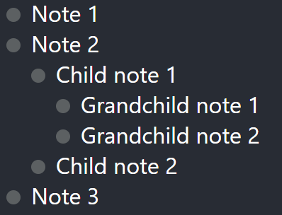

# react-outliner

A Workflowy-style outliner UI component for React.



Live demo here: [https://ashleydavis.github.io/react-outliner/](https://ashleydavis.github.io/react-outliner/)

I live streamed development of this component on Twitch! See [my YouTube channel](https://www.youtube.com/c/codecapers) to watch the recorded live stream:

If you like this project, please star this repo and [support my work](https://www.codecapers.com.au/about#support-my-work)

## Use it

Install it in your React application:

```bash
npm install --save react-outliner
```

Import it in your React code:

```javascript
import { Outliner } from "react-outliner";
```

Use it in your `render` function:

```javascript
    <Outliner notes={notes} />
```

For notes you can start with an empty array, you can create an array/tree of notes or you can load data from a database.

Each note must have an id that is locally unique with in the notes data structure.

Here's an example setup to get started:

```javascript
const notes = [
    {
        id: "1",
        text: "A note",
        children: [],
    },
    {
        id: "2",
        text: "Another note",
        children: [
            {
                id: "3",
                text: "A child note!",
            },
        ],
    },

];
```

## Example

You can find a complete example in the `example` subdirectory of the code repository.

Live demo here: [https://ashleydavis.github.io/react-outliner/](https://ashleydavis.github.io/react-outliner/)


